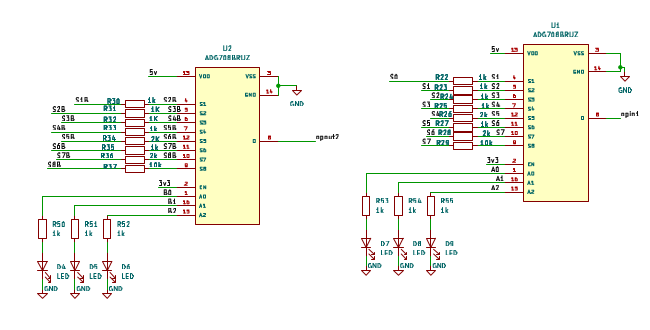
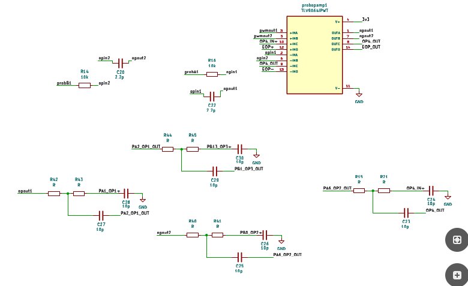
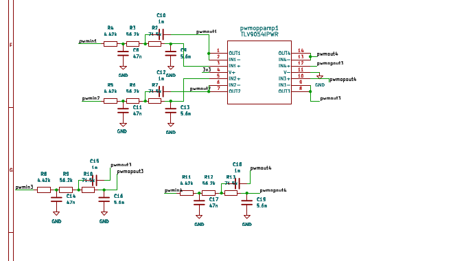
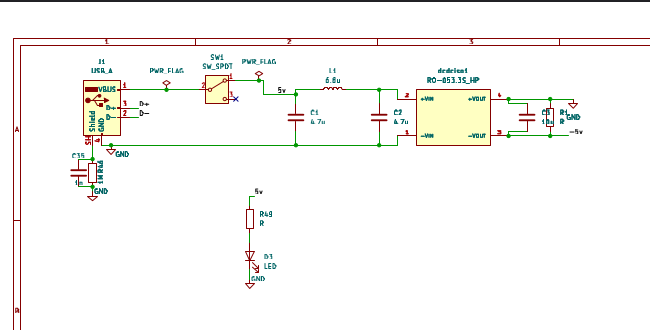
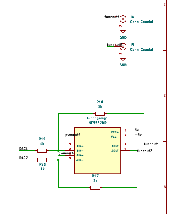
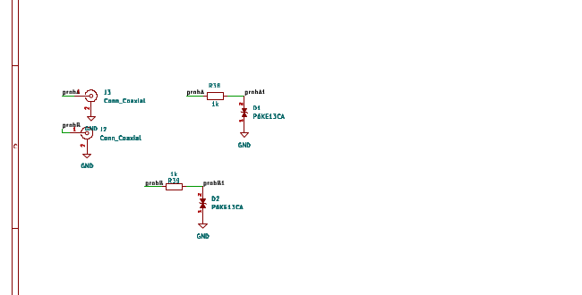
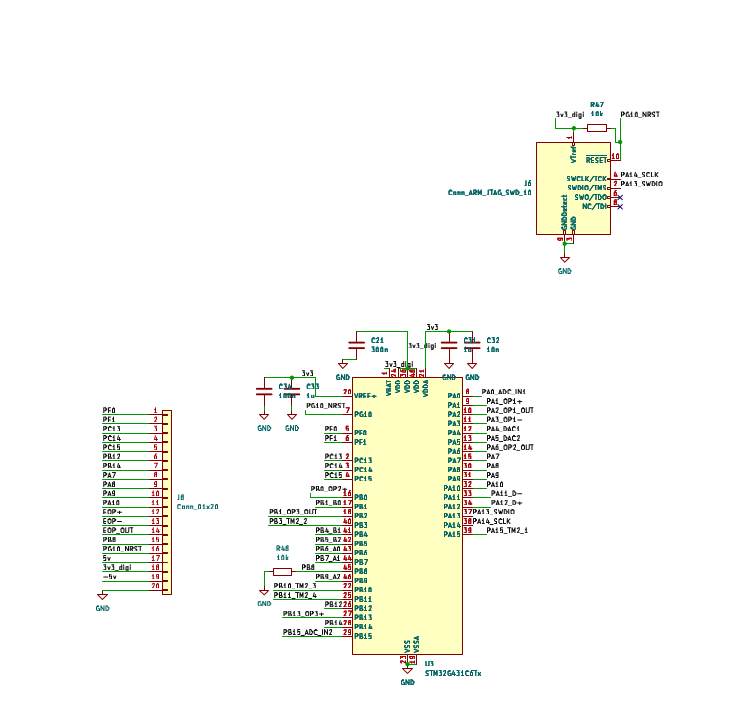
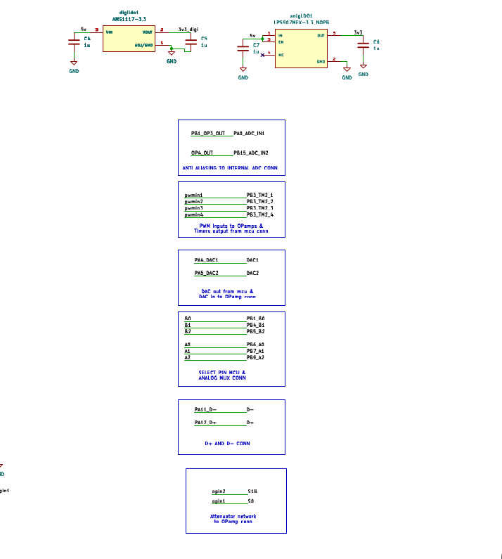

# DSO
Making a digital oscilloscope for frequency range upto 500khz and voltage range upto +-10V. Sharing the waveforms via pc communication to project it on gui using USB2.0 1MBps speed
## You can see full schematics in assessment1/DSO_1draft/DSO_1draft.pdf

## Hardware Subsystems & Circuit Schematics

### 1. Analog Input & Channel Multiplexing
Routes and selects between analog input channels and attenuation paths to direct the conditioned signal toward the sampling stage.

---

### 2. Anti-Aliasing Filter
An active low-pass filter stage designed to attenuate high-frequency components above the Nyquist limit, preventing aliasing distortion at the ADC inputs.

---

### 3. PWM-to-DC Offset Generator
Filters a high-frequency PWM signal from the microcontroller through a low-pass network, producing an adjustable analog DC offset to center and bias bipolar input waveforms within the ADC's 0–3.3V dynamic range.

---

### 4. Symmetric Dual Supply Generation (±5V)
Generates clean positive (+5V) and negative (-5V) rails to supply the operational amplifiers, providing the necessary headroom and swing for true bipolar signal conditioning.

---

### 5. Onboard Function Generator
Generates test signals (e.g., standard 1 kHz square reference or calibration waveforms) for probe compensation, debugging, and self-testing.

---

### 6. Input Connectors & Channels
Interface connectors (BNC/header pins) for Channel 1 and Channel 2, providing signal entry, grounding, and initial protection.

---

### 7. MCU Programming & Debug Header
Breakout interface (SWD/JTAG and UART/power pins) for flashing firmware to the microcontroller and monitoring real-time telemetry during development.

---

### 8. Net Name & Pin Matching Guide
Reference diagram mapping schematic netlabels, board bus connections, and microcontroller GPIO pinouts across different modules.

